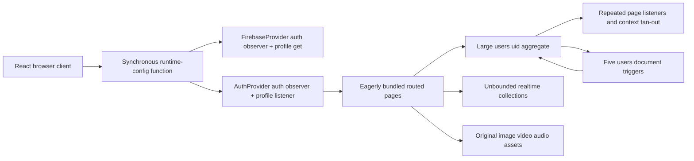

# Repository-wide performance audit

## Executive assessment

FND's largest performance risks are architectural amplification effects rather than isolated slow statements:

- Every route is statically imported, producing a single large startup graph.
- Firebase initialization performs a synchronous network request before React mounts.
- A growing `users/{uid}` aggregate is observed by duplicate listeners, rewritten for unrelated concerns, synchronously cached, and processed by multiple document triggers.
- Several pages subscribe to entire collections and rebuild complete client arrays for one-document changes.
- Original media is commonly used for thumbnails, and large lists are rendered without a transfer, DOM, decode, or memory budget.
- Grigliata combines 27 production listeners with a 6,673-line page, a 7,539-line board, frame-driven React state, repeated geometry, full fog atlas rebuilding, and amplified writes.
- Measurement is missing: Web Vitals are invoked without a reporter, there are no performance budgets or CI workflows, and most non-Grigliata routes lack meaningful data-path tests.

The sequence in [`README.md`](./README.md) addresses fast, low-risk startup wins first, introduces measurement and data-access boundaries, then handles schema and page hot paths. The ordering deliberately leaves aggressive memoization, workers, and large migrations until correctness contracts and baselines exist.

## Current architecture and amplification path

One user write can therefore cause multiple listener deliveries, whole-document serialization, broad React rerenders, five trigger invocations, and follow-up writes that repeat the cycle.

## Quantitative repository indicators

Production code counts are static indicators, not runtime measurements:

| Area | Production lines | `useState` | `useEffect` | `onSnapshot` | Firestore writes |
|---|---:|---:|---:|---:|---:|
| Grigliata | 32,366 | 203 | 135 | 27 | 88 |
| Bazaar | 6,493 | 119 | 41 | 7 | 14 |
| DM Dashboard | 5,125 | 136 | 23 | 2 | 22 |
| Home | 3,903 | 66 | 18 | 4 | 27 |
| Common | 2,362 | 21 | 8 | 0 | 6 |
| Echi di Viaggio | 2,194 | 39 | 15 | 3 | 8 |
| Tecniche/Spell | 2,006 | 42 | 14 | 1 | 2 |
| Combat Tool | 1,954 | 29 | 14 | 10 | 23 |
| Codex | 1,371 | 28 | 4 | 1 | 5 |
| Foes Hub | 1,197 | 18 | 4 | 1 | 3 |
| Character creation | 1,168 | 25 | 7 | 1 | 8 |

The frontend production graph contains 58 `onSnapshot` calls, 125 direct `getDoc/getDocs` calls, and 208 Firestore write/transaction construction sites. These counts identify review areas; they do not imply every call is active at once.

## Highest-priority confirmed findings

### P0: startup and shared runtime

1. **All routes are eager.** `frontend/src/App.js:4-16` imports every page before route or role selection. The existing build has a 2.65 MB raw / 700 KB gzip main JavaScript asset and only one small async chunk.
2. **Firebase config blocks the main thread.** `frontend/src/components/firebaseConfig.js:41-65` issues `XMLHttpRequest.open(..., false)` and `send()` during module evaluation. The Hosting rewrite points this request to a Cloud Function (`frontend/firebase.json:140-145`), adding network and possible cold-start latency before React can render.
3. **Auth/profile work is duplicated.** `frontend/src/index.js:5,13-17` mounts an otherwise unused `FirebaseProvider`; `context/FirebaseContext.js:17-33` observes auth and reads the user. `App.js:103` mounts `AuthProvider`, which observes auth again and starts the authoritative profile listener.
4. **Whole-profile localStorage work is synchronous.** `AuthContext.js:55-64` serializes and writes the entire user document after every snapshot, while children remain hidden until the live profile resolves (`:106-109`).
5. **The global shell is always busy.** `Layout.js:23-24` mounts 140 animated star elements and the Grigliata music player on every authenticated route. `GlobalAuroraBackground.js:92-111` runs interval/click listeners and an ever-growing timeout-handle array; `GlobalGrigliataMusicPlayer.js:146-168` holds two listeners and creates `preload="auto"` audio elements (`:370-385`).

### P0: Firestore and data model

1. **Home observes one user document five times.** The targets are `AuthContext.js:50-72`, `StatsBars.js:31-52`, `Inventory.js:38-112`, `EquippedInventory.js:73-82`, and `paramTables.js:204-219`.
2. **The user document is a scaling boundary.** Inventory stores deep item snapshots and is rewritten as an array (`bazaar/elements/acquireItem.js:35-68`). Spells, techniques, stats, settings, inventory, and equipment share the same snapshot and trigger surface.
3. **Firestore indexes are not represented in source.** `frontend/firestore.indexes.json` contains no indexes even though the application relies on compound visibility, placement, AoE, encounter, and ordered/paginated query shapes.
4. **Static configuration is repeatedly fetched.** `utils/varie`, schemas, and Codex data are independently read by Home, character creation, Bazaar, Tecniche/Spell, cards, and actions. Several caches store only resolved values, allowing simultaneous card mounts to produce a thundering herd.
5. **Collections are commonly unbounded.** Bazaar items, users in DM/Admin selectors, foes, NPCs, Echi markers, Grigliata presence/sessions/libraries, and encounter lists have paths that scale with total history rather than a configured page size.

### P0: server architecture

1. **Every user update invokes five document triggers.** `updateTotParameters`, `updateHpTotal`, `updateManaTotal`, `updateAnimaModifier`, and `expireBarriera` all target `users/{userId}`. Early exits reduce writes but not trigger delivery. Derived-field writes invoke the trigger set again.
2. **Derived totals rewrite broad fields.** `updateTotParameters.ts:99-103` writes the full `Parametri` map. HP and mana independently reread `utils/varie` (`updateHpTotal.ts:53-68`, `updateManaTotal.ts:55-70`).
3. **Functions use three region strategies.** Shared frontend callables use `europe-west1`; point spending uses default/`us-central1`; admin/level functions use `europe-west8`. Region clients are constructed in multiple page modules.
4. **Bulk functions exceed fixed ceilings.** `levelUpAll.ts:40-91` uses one batch with two writes per updated user, and its declared idempotency key is unused. NPC/lock/encounter deletion paths also assume one batch or perform client-side recursive reads.
5. **Foe duplication is serial.** `duplicateFoeWithAssets.ts:129-179` copies main, technique, and spell media sequentially; the UI does not send the supported idempotency key.
6. **The Python backend is mostly a healthcheck but imports Firebase/admin tooling on startup.** `backend/main.py:3-10` loads Firestore and a large maintenance/schema module before the single route at `:40-42`. Maintenance scans include an N+1 user refetch at `:100-114`.

## Route-by-route findings and task mapping

| Route | Highest-confidence problems | Planned task |
|---|---|---|
| `/` Login | Extra profile read, preflight account request, 1.5 s navigation delay, decorative rerenders | 02, 03, 08 |
| `/character-creation` | Repeated config reads, seven serial race-step operations, duplicate profile listener, preview leaks | 04, 07, 08 |
| `/home` | Five profile listeners, 200 ms write intervals, duplicate inventory normalization, stale consumable state | 05, 07, 08 |
| `/bazaar` | Full catalog listener, hover remount/network churn, repeated filtering/sorting/logging, eager editors/media | 09, 10 |
| `/dm-dashboard` | Full user aggregates, redundant full refreshes after mutations, eager catalog/editors, per-expanded-user dice listener | 11 |
| `/admin` | Full user aggregates for five columns, no pagination/search tests | 11 |
| `/codex` | Entire knowledge base in `utils/codex`, full transfer/contention/document ceiling, continuous GPU background | 12 |
| `/tecniche-spell` | Duplicate profile listener, shared-config thundering herd, unbounded card render/filter, stale mana writes | 13 |
| `/foes-hub` | Full foe listener, original media thumbnails, unstable row/chart props, serial duplication | 13 |
| `/combat` | Unbounded encounter/user lists, `2 + U + F` detail listeners, serial repair writes, client recursive delete | 14 |
| `/echi-di-viaggio` | 14.89 MB maps, duplicate NPC listener, unbounded markers, marker-tree hover rerenders | 15 |
| `/grigliata` | Always-on domain listeners, whole-board rerenders, duplicate visibility, full fog rebuilds, amplified writes | 16-21 |

## Grigliata deep findings

### Realtime data plane

`useGrigliataPageData.js:148-637` keeps state, token profiles, foes, folders, presence, backgrounds, placements, AoE figures, interactions, music, playback, and sessions active. Several are relevant only to one manager tab. Player AoE state can add up to 20 per-document listeners (`:472-523`). Presence and interactions are expired by client clocks (`:639-699`) after stale records were already delivered. Snapshot handlers remap complete collections instead of applying `docChanges()`.

### Board rendering and input

`GrigliataBoard.js:4848-5211` handles raw mouse movement with repeated React state writes. Ping animation updates component state on every animation frame (`:3626-3656`). Static map/grid, fog, lighting, tokens, and overlays reconcile through the same component (`:6735-7078`); `TokenNode` is not memoized (`grigliataBoardTokenUi.js:250-472`), and handlers/control objects are frequently recreated by the page (`GrigliataPage.js:6368-6420`).

### Video and geometry

Video backgrounds start an unconditional animation-frame draw loop (`GrigliataBoard.js:2954-2997`) and request both full-stage and layer draws. Visibility is computed across page, board, lighting mask, and persistence paths. `lightingGeometry.js:221-298` casts rays against segments with approximately source-by-ray-by-segment behavior; ray direction work is repeated inside segment intersection (`:129-138`).

### Fog

One default 128 x 128 raster tile performs 16,384 sample tests (`fogRasterMemory.js:292-361`). Tile snapshots re-normalize/decode/sort the whole set (`useGrigliataFogOfWar.js:54-90`), and atlases loop through every pixel (`fogRasterMemory.js:505-550`). Brush work can repeat rasterization for every active owner (`GrigliataPage.js:5014-5076`). Persistence performs nontransactional client read-merge-write with unbounded `Promise.all` (`useGrigliataFogOfWarPersistence.js:465-549`), so concurrent clients can lose reveals.

### Writes, music, and migrations

Token movement writes both placement and owner settings (`useGrigliataPlacementActions.js:269-320`) even when visibility is unchanged. Lighting edits sequentially write multiple full-array documents (`GrigliataPage.js:5286-5628`) and can expose inconsistent revisions. Grigliata duplicates the global music subscriptions, while one audio node is created per unbounded session. Normal route entry can also run token/placement migrations (`GrigliataPage.js:1784-1977`).

## Media and memory

- Echi's two source PNGs total 14,889,339 bytes.
- List images generally lack lazy loading, async decoding, intrinsic dimensions, responsive sources, or derivatives.
- Upload rules allow images up to 8-15 MB and video/audio up to 25 MB; UI paths do not consistently enforce tighter product budgets before upload.
- `common/imageAssets/imageAssetRegistry.js:1-180` retains decoded `Image` objects indefinitely and preloads with unbounded `Promise.all`.
- Several preview paths create object URLs without revoking replacement/unmount URLs, including Character Creation, Inventory, and Bazaar editors.
- Gallery rows instantiate media elements and original assets even when offscreen; global music uses `preload="auto"` for every session.

## Render and animation

- The global aurora uses many continuously animated DOM nodes and reacts to every window click.
- Codex creates multiple large blurred, continuously animated nebula layers and does not pause for reduced motion or hidden documents.
- List pages often map all records; filtering/sorting runs synchronously on each keystroke or hover.
- Large monoliths hold many independent state domains, causing unrelated updates to share a render boundary. File splitting is valuable only when it creates measured subscription and render isolation.

## Testing and observability gaps

The current 52-suite/624-test frontend baseline passes, but route coverage is concentrated in Grigliata. There are no focused behavioral/performance tests for Login, AuthContext, Character Creation, Home, DM Dashboard, Admin, Codex, Tecniche/Spell, or Foes Hub. Combat and Echi shell tests mock their performance-sensitive children. There are no Functions tests, Python backend tests, true emulator rules tests, browser performance tests, or CI workflow.

`frontend/src/index.js:21` calls `reportWebVitals()` with no callback, so field metrics are not recorded. The current rules-complexity test checks source text rather than executing authorization/query behavior against the emulator.

## Opportunities that require measurement before adoption

These are plausible but should not be implemented as assumptions:

- Web Workers/OffscreenCanvas for geometry and fog: first remove duplicate work and make updates incremental.
- Blanket `React.memo`: first stabilize props and add render counters.
- Persistent Firestore cache: validate account switching, multi-tab ownership, stale-data UX, and storage limits.
- Broad denormalization: define authoritative ownership and consistency before copying fields.
- A build-tool migration: measure whether route splitting/budgets can be delivered safely first, then assess toolchain cost separately.
- Function `minInstances`: compare cold-start latency against recurring cost after region and bootstrap design are settled.

## Definition of success

The plan succeeds when work is bounded by the active route and configured page/scene size rather than total historical data, and when a local interaction updates only the corresponding data and render domain. Task 22 turns that principle into final measured gates and operational rollback criteria.
